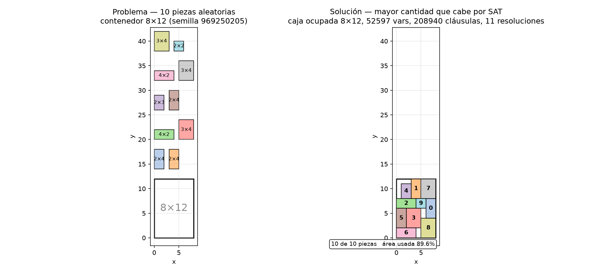
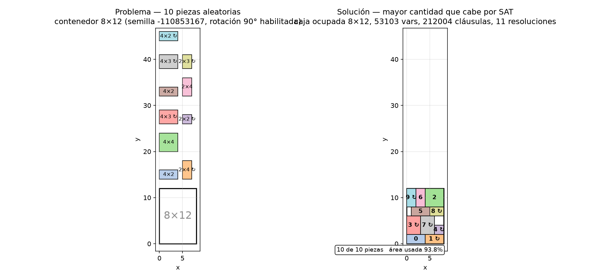

# satx · Sistema de Cómputo Clónico

**Librería autocontenida de C++26 para aritmética de números complejos CBE
(Complejo Binario Entrelazado) resolubles por SAT.**

`satx` compila restricciones aritméticas sobre números complejos de punto
fijo — escritas en un formato numérico original — a circuitos booleanos
(CNF) y las resuelve con **Kerberos**, el motor de resolución embebido del
sistema, escrito en C17 e integrado como parte integral del producto: **sin
dependencias de terceros** y **sin solvers externos**.

Una misma expresión puede evaluarse por dos rutas:

- **Ruta concreta** — operaciones sobre constantes, evaluadas `constexpr`
  con aritmética exacta sobre enteros de 128 bits.
- **Ruta simbólica** — las incógnitas son variables booleanas libres; cada
  operación compila un circuito (gates Tseitin → CNF) que el kernel CDCL
  **SLIME** de Kerberos resuelve, devolviendo los valores de las incógnitas.

**Precisión y detección de pérdida.** La aritmética interna es exacta (enteros
de 128 bits en la ruta concreta; circuitos booleanos en la simbólica). El
acceso `value()` devuelve `double` y **detecta** la pérdida de precisión: si
el valor exacto `raw/2^F` no es representable en `double` (más de 53 bits
significativos), lanza `std::overflow_error` en lugar de devolver un valor
redondeado silenciosamente. Para el valor exacto sin pasar por `double`,
use `value_raw()` (componentes enteras `int64`).

---

## El formato numérico CBE(W,F) — Complejo Binario Entrelazado

El sistema opera sobre un formato numérico **original, de autoría propia de
Oscar Riveros (2026)**, definido en el documento «Modelo Unificado de Cómputo
Clónico». **No procede de ningún estándar, biblioteca ni trabajo previo: no
es la representación clásica de números complejos.**

**Definición (CBE(W,F)).** Una palabra de `2W` bits `Z[2W−1:0]` representa
un número complejo `z = a + i·b` con **entrelazado por cableado**: los
**bits pares** son el carril real y los **bits impares** el carril
imaginario:

```
Z[2k]   = R[k]     (carril real)
Z[2k+1] = I[k]     (carril imaginario)      k = 0..W−1
```

Cada carril codifica en **base −2 (negabinaria)** con `F` posiciones
fraccionarias; el exponente de la posición `k` es `e(k) = k − F`:

```
Re(Z) = Σ_{k=0}^{W−1} R[k]·(−2)^(k−F)
Im(Z) = Σ_{k=0}^{W−1} I[k]·(−2)^(k−F)
Z     = Re(Z) + i·Im(Z)
```

Forma equivalente: `z = (re + i·im) · 2^(−F)`, con `re = Σ R[k]·(−2)^k` e
`im = Σ I[k]·(−2)^k` en `[min_NB(W), max_NB(W)]`. El paso numérico mínimo es
`2^(−F)`. La representación es **biyectiva**: toda palabra de `2W` bits es un
número válido y único (el conjunto representable contiene exactamente
`2^(2W)` puntos de un reticulado de paso `2^(−F)`), lo que permite operar de
dos maneras sobre el mismo tipo.

---

## Kerberos — el motor de resolución

**Kerberos** es el motor de resolución del sistema: un conjunto de kernels
escritos en **C17**, sin dependencias de terceros, compilados una sola vez
en la biblioteca estática `satx_kerberos` y compartidos por el puente C++26
(`satx_solver`) y el despachador de línea de comandos (`kerberos`).

Cada kernel recibe el nombre de una **cabeza** del motor:

### SLIME — SAT CDCL (la cabeza principal)

Kernel de satisfacibilidad booleana (SAT) sobre CNF, con arquitectura CDCL
moderna:

- **Propagación** por watch lists con literal bloqueante; binarias tratadas
  en línea.
- **Ramificación** VSIDS (heap por actividad con reescalado) o CHB, con
  selección por MAB y guardado de fases (phase saving).
- **Reinicios** Luby + EMA con margen adaptativo y reutilización de niveles
  del trail.
- **Análisis de conflictos** 1-UIP con minimización recursiva (iterativa),
  subsumción eager de las últimas cláusulas aprendidas y reutilización de la
  cláusula de conflicto.
- **Backtracking cronológico** acotado (`--chrono`).
- **Reducción de la base de cláusulas** por calidad (LBD) con niveles
  (tiering: binarias, LBD ≤ 2 y tamaño ≤ 6 se conservan).
- **Rephasing** periódico de fases (`--rephase`).
- **Covertrace**: cubos de escape y sondeo de reinicios para escapar de
  mínimos locales.
- **HESS**: búsqueda local exacta como atajo inicial (opcional).
- **Simplificación raíz**: literales puros, sondeo de literales fallidos
  (bounded), subsumción y fortalecimiento (self-subsuming resolution),
  sustitución de literales equivalentes (SCC sobre el grafo de implicación
  binario) y eliminación acotada de variables (`--bve`, experimental, con
  reconstrucción de modelo).
- **Sesiones incrementales** con suposiciones (assumptions) y extensión de
  modelo para variables eliminadas.
- **Pruebas DRAT** (`--proof`) para verificación independiente de UNSAT.
- Formato de salida DIMACS (`s SATISFIABLE` / `s UNSATISFIABLE`).

### BASILISK — conteo exacto de modelos (#SAT)

Kernel de conteo exacto de modelos sobre CNF (model counting), útil para
enumerar todas las soluciones de un circuito con cláusulas de bloqueo.

### PIXIE — LP/MIP

Kernel de programación lineal y mixta (LP/MIP) sobre formatos LP y MPS;
resuelve también las instancias WMIBO puramente lineales.

### WMIBO — modelos híbridos booleano-lineales

Kernel de modelos ponderados/híbridos booleano-lineales y de compatibilidad
con flujos de trabajo clásicos de optimización booleana.

### GRINDER — verificador de pruebas DRAT/RUP/RAT

Verificador de pruebas de insatisfacibilidad en formato DRAT (y variantes
RUP/RAT), usado para certificar de forma independiente los resultados UNSAT
del sistema.

### KRB_ACCEL — capa de aceleración

Capa de aceleración del motor con interfaz estable y soporte de respaldo
(«stub») para aceleración por hardware (CUDA).

### KRB_PARALLEL — capa de paralelismo

Capa de paralelismo del motor con respaldos intercambiables: secuencial
(stub), hilos (threads) y MPI (mensajes), para dividir instancias y
ejecutar carteras de solvers en paralelo.

### El despachador (`kerberos` CLI)

El ejecutable `kerberos` enruta cada instancia a la cabeza adecuada según
el formato del archivo de entrada y reenvía las opciones de cada kernel.
Uso básico:

```
bin/kerberos instancia.cnf              # SAT con SLIME
bin/kerberos --grinder f.cnf f.drat -w  # verificación DRAT con GRINDER
bin/kerberos --help
```

### El puente C++26 (`satx_solver`)

`src/solver/kerberos.cpp` + `include/satx/solver/kerberos.hpp` exponen el
motor a C++26: opciones del kernel (`satx::solver::options`), resolución
(`satx::solver::solve`), modelo (`satx::solver::model`) y estadísticas.
Es la vía que usa toda la biblioteca `satx`.

---

## Estructura del repositorio

```
satx/
├── include/satx/          # núcleo C++26 (header-only)
│   ├── core/              # engine, CNF, cláusulas, literales
│   ├── gates/             # primitivas y vectores de bits
│   ├── num/               # negabinario, punto fijo, complex (CBE)
│   ├── quantum/           # circuitos, estados y gates cuánticos
│   └── solver/            # puente C++26 → Kerberos
├── src/kerberos/          # Kerberos (C17): SLIME, BASILISK, PIXIE, WMIBO,
│                          # GRINDER, KRB_ACCEL, KRB_PARALLEL, despachador
├── src/solver/            # puente C++ (kerberos.cpp)
├── examples/              # 17 ejemplos completos
├── tests/                 # suite de pruebas sin framework
├── benchmarks/            # generadores, validador de modelos y corredor
├── docs/                  # architecture.md, manual.md
├── template.cpp           # «Hola, mundo» (ver abajo)
├── CMakeLists.txt
└── LICENSE.txt            # licencia dual (ver más abajo)
```

---

## Compilación

Requisitos: CMake ≥ 3.28 y un compilador con soporte de **C++26** y C17
(MSVC 2022 17.14+, GCC 15+, Clang 20+).

```
cmake -S . -B build
cmake --build build
```

Los binarios se generan en `bin/`. Opciones de configuración:

- `SATX_BUILD_TESTS=ON|OFF` — suite de pruebas (por defecto ON).
- `SATX_BUILD_KERBEROS_CLI=ON|OFF` — despachador CLI `kerberos` (ON).

## Pruebas

```
ctest --test-dir build --output-on-failure
```

La suite (sin framework: aserciones y bucles de propiedad) cubre:

- `test_negabinary` — aritmética de base −2.
- `test_complex_ops` — operaciones de `complex<W,F>` en ambas rutas.
- `test_kerberos` — kernel CDCL (SAT/UNSAT, sesiones, suposiciones).
- `test_quantum_echoes` — problemas inversos cuánticos (aprendizaje de B).
- `test_solver_api` — API del puente C++ (modelos, bloqueos, conteo).

## Benchmarks

`benchmarks/` incluye un generador determinista de instancias CNF
(3-SAT aleatorio, pigeonhole, multiplicadores y circuitos Tseitin,
multiplicación compleja estilo CBE, n-reinas, paridad, coloreo y sudoku),
un validador externo de modelos y un corredor con límite de tiempo que
verifica cada resultado: SAT → comprobación del modelo contra la instancia
original; UNSAT → prueba DRAT verificada con GRINDER.

```
benchmarks/tools/gen_benchmarks.exe benchmarks/cnf
powershell -File benchmarks/run.ps1
```

---

## Ejemplos

`template.cpp` — **«Hola, mundo» del sistema**: declara tres incógnitas
complejas CBE, impone `z == x + y` y resuelve con el kernel SLIME. Es el
punto de partida recomendado para principiantes.

Los ejemplos completos en `examples/`:

| Ejemplo | Descripción |
|---|---|
| `send_more_money` | Criptoaritmética clásica SEND + MORE = MONEY con acarreos. |
| `map_coloring` | Coloreo de grafos (mapa de Australia) con 3 colores. |
| `nqueens` | Las N reinas sobre un tablero 4×4. |
| `rect_packing` | Empaquetado 2D estilo mochila: cuántos rectángulos aleatorios caben en un contenedor (N, H, W y semilla por parámetros), optimizado por SAT; genera JSON para graficar con `plot_packing.py`. |
| `rect_packing_rot` | Igual que `rect_packing` pero con rotación de 90° habilitada: cada pieza decide además si gira (literal r_i, dimensiones efectivas por multiplexor de rieles NB); grafica con `plot_packing_rot.py`. |
| `optimize_sum` | Optimización usando SAT como oráculo (maximizar x+y con restricciones). |
| `job_shop` | Planificación con dos máquinas, tareas sin solaparse y plazo. |
| `dice_distribution` | Distribución de probabilidad de un dado trucado (fracciones 2⁻³). |
| `projectile` | Física: tiro parabólico; hallar la velocidad inicial para un blanco. |
| `gaussian_integer_factorization` | Factorización de enteros gaussianos por SAT (grilla Z[i] exacta). |
| `mandelbrot_escape` | El conjunto de Mandelbrot como problema SAT (tiempo de escape exacto). |
| `quantum_bell` | Estado de Bell: H + CNOT sobre \|00⟩, ruta concreta. |
| `quantum_learning` | Problema inverso cuántico: aprender B a partir de un dato OTOC. |
| `quantum_teleportation` | Teletransporte cuántico con medición clásica (las cuatro salidas). |
| `sudoku` | Sudoku 9×9 resuelto por SAT con la aritmética CBE. |
| `model_counting` | Conteo de modelos (#SAT) con cláusulas de bloqueo y sesiones incrementales. |
| `complex_polynomial_roots` | Raíces de un polinomio con coeficientes CBE, enumeradas por SAT. |

Ejemplo visual (`rect_packing`, generado con `plot_packing.py`):



Con rotación de 90° habilitada (`rect_packing_rot`, generado con
`plot_packing_rot.py`; «↻» marca las piezas que giraron):



---

## Licencia dual

El sistema completo — núcleo CBE(W,F), Kerberos y todas sus cabezas, el
puente C++26, la documentación, los ejemplos y los bancos de pruebas — se
distribuye bajo **licencia dual**:

1. **Uso personal**: Apache License, Versión 2.0.
2. **Uso comercial y portes** (portar el sistema, en todo o en parte, a otros lenguajes de
   programación): **licencia comercial** con la **autorización expresa y
   escrita del autor (Oscar Riveros)**, quien establecerá las condiciones y
   el precio de la transacción. Ninguna autorización se presume.

Los términos completos se detallan en [`LICENSE.txt`](LICENSE.txt), que
incluye el texto íntegro de la Licencia Apache 2.0 y la adenda comercial
para portes.

---

## Autoría

- **Formato numérico CBE(W,F) — Complejo Binario Entrelazado**: Oscar
  Riveros (2026), «Modelo Unificado de Cómputo Clónico».
- **Sistema satx y motor Kerberos**: Oscar Riveros (2026).

Copyright © 2026 Oscar Riveros. Todos los derechos reservados.
